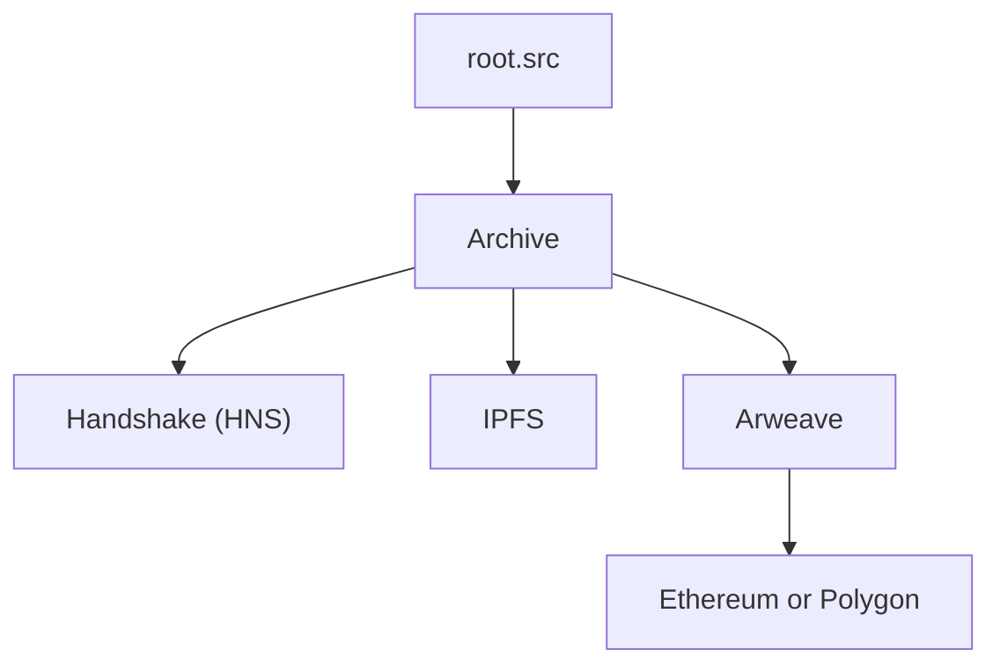

## How it Works



```markdown
### root.src  
A decentralized verification and identity layer built on Handshake (HNS), IPFS, and blockchain protocols.

### Archive  
Answers are stored in an archive; each entry gets a hash.

### Handshake (HNS)  
For domain identity and root verification.

### IPFS  
Decentralized content hosting.

### Arweave  
Permanent archival of data.

### Ethereum or Polygon  
Used for storing hashes in a tamper-proof way.
