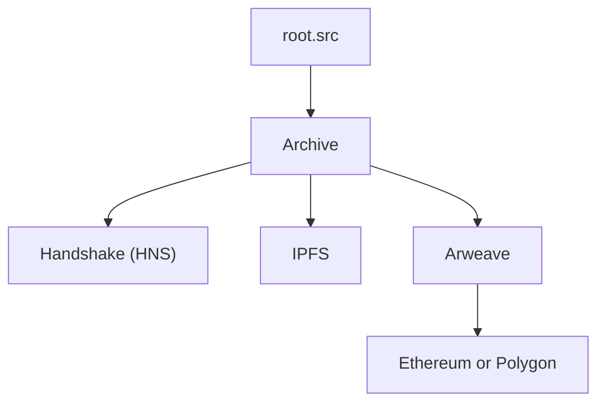

## How it Works

```mermaid
flowchart TD
    A["root.src"]
    B["Archive"]
    C["Handshake (HNS)"]
    D["IPFS"]
    E["Arweave"]
    F["Ethereum or Polygon"]

    A --> B
    B --> C
    B --> D
    B --> E
    E --> F
```
